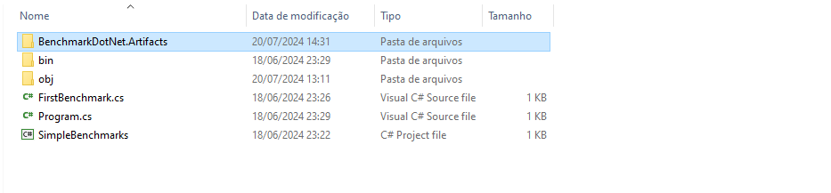
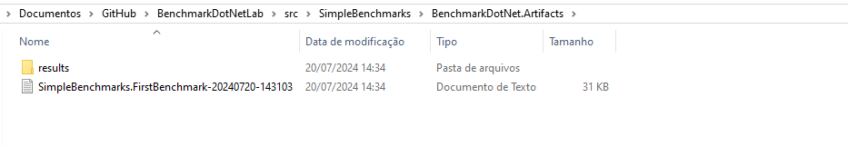
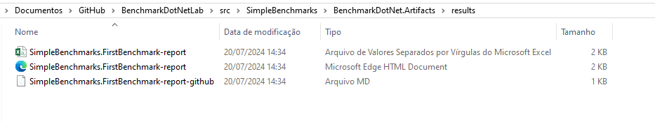

# Benchmark .NET Lab

Repositório de testes e estudos da _lib_ **[BenchmarkDotNet](https://github.com/dotnet/BenchmarkDotNet)**.


## Orientações

Para executar o benchmark, é necessário executar o projeto em modo **"Release"**, pois a _lib_ não funciona em modo **"Debug"**.


### Execução via CLI

Para executar o projeto via CLI, abra o prompt de comando no diretório onde está o arquivo CSPROJ do projeto de Benchmark e execute o comando:

```
dotnet run -c release
```

Ao usar a CLI para executar o benchmark, é gerado um diretório chamado **"BenchmarkDotNet.Artifacts"** e dentro dele é armazenado os resultados dos benchmarks, em arquivos `.csv` (Excel), `.html` (página Web) e `.md` (MarkDown).








## Resultados

### Projeto SimpleBenchmarks

#### FirstBenchmark

Resultado dos primeiros testes criados em **FirstBenchmark**, para análise do uso do método `EndsWith()` utilizando `string` e `char`.


