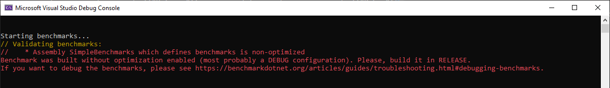
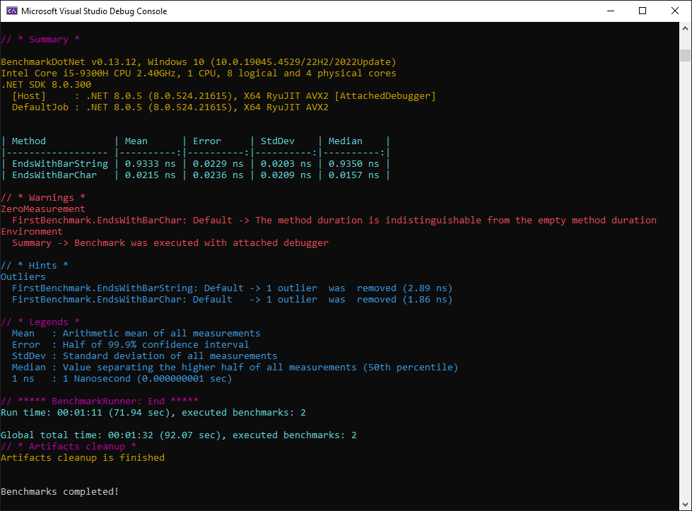

# Benchmark .NET Lab

Repositório de testes e estudos da _lib_ **[BenchmarkDotNet](https://github.com/dotnet/BenchmarkDotNet)**.

## Orientações

Para executar o benchmark, é necessário executar o projeto em modo **"Release"**, pois a _lib_ não funciona em modo **"Debug"**.

## Resultados

### Projeto SimpleBenchmarks

#### FirstBenchmark

Resultado dos primeiros testes criados em **FirstBenchmark**, para análise do uso do método `EndsWith()` utilizando `string` e `char`.

